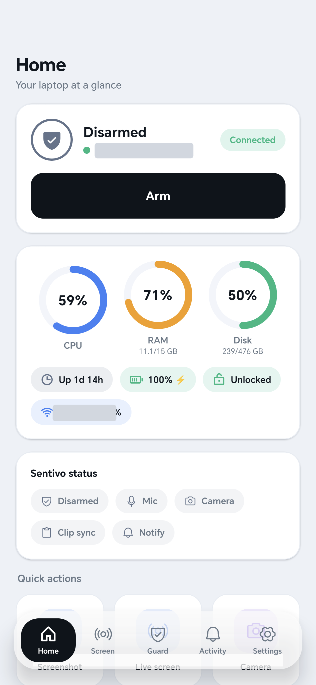
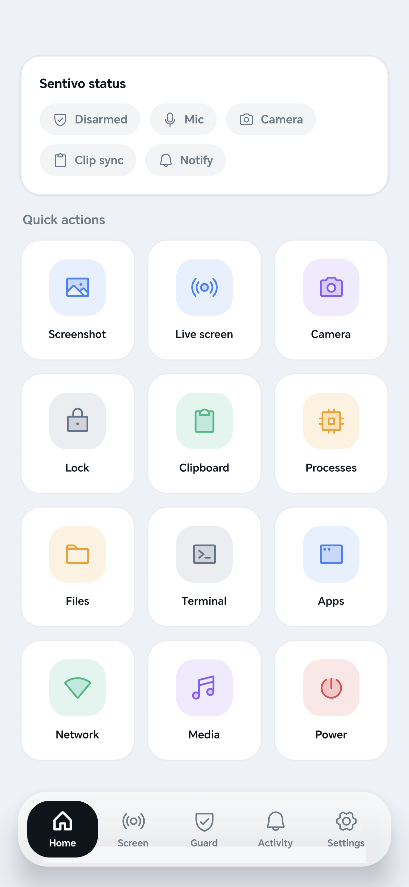
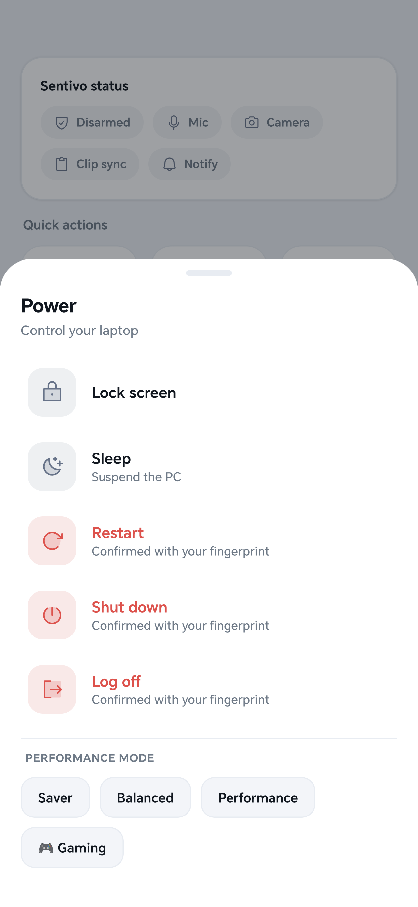
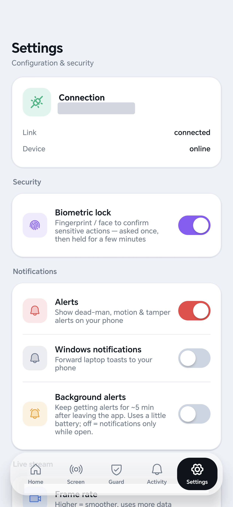

# Sentivo

Monitor and control your Windows PC from your Android phone — through a custom
app and a live screen. A tiny agent runs on the PC and connects **out** to a small
relay you host, so there are no inbound ports and nothing to expose. Watch the screen
live, drive the mouse and keyboard, browse and transfer files, sync the clipboard, see
live resource graphs, and get push alerts if someone touches it — even with the app
fully closed.

Two ~7 MB static Go binaries (agent + relay) and one Expo/Android app. No runtime to
install on the PC, near-zero cost when idle.

## Screenshots

<p align="center">
  
  
  
  
</p>

## What it does

- **Live screen & control** — stream the screen to the app at a configurable frame rate,
  fullscreen with floating controls, tap-to-click / hold for right-click, and a keyboard.
- **Resources** — CPU, RAM, GPU, every fixed disk, WiFi, battery, uptime — animated ring
  gauges, tap any for a live history chart.
- **Files** — browse the PC's folders, download to your phone, upload from your phone
  (both ways, up to 20 MB per file).
- **Clipboard** — send text to the PC, and live-sync copies back to the phone (with a
  dismissible snackbar).
- **Power & performance** — lock, sleep, restart, shut down, log off (biometric-confirmed),
  plus power modes: Saver / Balanced / Performance / **Gaming** (Ultimate power + Game Mode).
- **Terminal** — run PowerShell on the PC from your phone (biometric-gated).
- **Apps** — list running apps; launch, focus (bring one to the front), or kill.
- **Network** — live down/up throughput, active connections, top remote peers.
- **Media** — play/pause, next/prev, volume from the phone.
- **Automations** — when-this-then-that rules (e.g. on-lock → screenshot).
- **Home widget** — status at a glance from your launcher; follows your device's dark/light theme.
- **Alerts (push)** — dead-man alert if the agent is killed, plus motion / mic / tamper
  and forwarded Windows notifications — delivered by FCM even when the app is closed, at
  no battery cost. See [`NOTIFICATIONS.md`](NOTIFICATIONS.md).
- **Sensors (opt-in, armed)** — mic level, camera motion.
- **Anti-theft** — approximate location, loud alarm.
- **Security** — biometric confirmation for sensitive actions; optional TOTP command gating.

## How it works

```
  Your phone                   Your server                  Your PC
 ┌───────────┐    WSS/TLS    ┌────────────┐   pinned TLS   ┌──────────┐
 │  Sentivo  │ ────────────▶ │            │ ◀───────────── │          │
 │  Android  │               │   relay    │   (outbound)   │  agent   │
 │    app    │ ◀── frames ── │            │ ──── cmds ───▶ │ (Windows)│
 └───────────┘               └────────────┘                └──────────┘
        ▲   push (FCM, even when the app is closed) ── relay POSTs to Expo ▲
```

- **agent** (Windows) connects *out* to the relay over TLS — no open ports on the PC,
  works behind any NAT/firewall, and reconnects automatically on network changes.
- **relay** is the always-on broker: it routes the app's commands to the agent, pushes
  replies / frames / events back, raises the dead-man alert, and sends closed-app pushes
  via Expo → FCM (it never holds any Google credentials).
- **app** is a light-themed Expo/Android app: pair once by scanning a QR the PC shows, then
  it holds a single device token in secure storage.

Single-user by design: one agent token = one account, bootstrapped from `AUTH_TOKEN`.

## Requirements

- A **Windows PC** (the machine you're controlling).
- An **Android phone**.
- Optionally a **Linux VPS** for always-on / anti-theft (the dead-man alert still fires if
  the PC is stolen or killed). Without one, run the relay on the PC itself.
- To build: [Go](https://go.dev) 1.22+, Node + the Expo CLI for the app. `ffmpeg` on the
  PC is only needed for camera features.

## Quick start

### 1. Build

```powershell
./build.ps1     # -> dist/agent.exe, dist/relay.exe (on-device), dist/relay (Linux VPS)
```

### 2. Run the relay

- **VPS / Dokploy (recommended):** deploy `relay/` (a Dockerfile is included). Set env
  `AUTH_TOKEN` (a random 24-byte hex) and `PUBLIC_URL` (e.g. `https://sentivo.example.com`);
  TLS is terminated by the proxy. Or use `deploy/setup-relay.sh` on a bare VPS.
- **On your PC only (no server):** `./install-relay-local.ps1` — prints an `AUTH_TOKEN` and
  the cert fingerprint. Trade-off: if the PC is off, so is the dead-man alert.

### 3. Install the agent

```powershell
./install-agent.ps1 -RelayBase "wss://<host>:8443" -RelayFp "<fp-or-empty-for-valid-TLS>" -Token "<AUTH_TOKEN>"
```

Installs to `%LOCALAPPDATA%\Sentivo`, registers a hidden scheduled task, and auto-starts at
every sign-in.

### 4. Pair the app

Build/install the Expo app from `app/` (`eas build -p android`). On the PC, open the tray
menu → **Pair a phone**; scan the QR in the app. It encodes `sentivo://pair?url=…&token=…`,
so there's no long token to type.

### 5. Enable push (optional)

Follow [`NOTIFICATIONS.md`](NOTIFICATIONS.md) to wire FCM through Expo (a one-time
`eas credentials` upload). Until then, notifications show while the app is open.

## Security model

- Agent connects **out** only — no inbound ports on the PC.
- Transport is **TLS**: a valid cert via your proxy (Dokploy/Let's Encrypt), or **self-signed
  with fingerprint pinning** on the agent link (a man-in-the-middle can't swap the cert).
- The relay obeys only a connection presenting the account's **token**; the app holds it in
  secure storage and never puts it in a URL.
- Live-view links use **ephemeral, view-only tokens** (10 min).
- **Biometric** (fingerprint/face) confirms sensitive actions in the app; optional **TOTP**
  can gate commands on the agent, verified on the device — the secret is never on the server.
- FCM credentials live in **Expo**, never in the relay or the repo. `google-services.json`
  and the service-account key are gitignored.

Honest caveats: a compromised VPS or PC is a compromised system; the browser fallback viewer
trusts a self-signed cert unless you front the relay with a real one; no third-party audit.

## Configuration

Both binaries read a `config.json` next to the executable (installers write it).

**agent** — `%LOCALAPPDATA%\Sentivo\config.json`:

| key | meaning |
|---|---|
| `relay_url` | `wss://host:8443/agent?token=...` |
| `relay_fp` | relay TLS fingerprint to pin (empty for valid TLS) |
| `totp_secret` · `totp_gated` | optional 2FA secret and gated-command list |
| `require_totp` | gate commands with TOTP (default off) |
| `stream_fps` · `visible` | default frame rate · tray/visible mode |
| `cam_device` · `ffmpeg_path` | webcam name · ffmpeg path |

**relay** — env vars or `config.json`: `auth_token`, `public_url`, `addr` (default `:8443`),
`no_tls` (when a proxy terminates TLS).

## Repo layout

```
proto/   shared wire type (proto.Msg)
relay/   the broker (Go) — account, routing, streaming, push, TLS
agent/   the Windows agent (Go) — commands, sensors, syscalls
app/     the Expo/Android app (TypeScript)
deploy/  systemd unit + VPS setup script
*.ps1    build and install scripts
```

## Building

```powershell
./build.ps1
go test ./...
cd app && npx tsc --noEmit
```

## License

[MIT](LICENSE).
